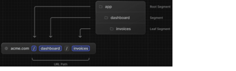
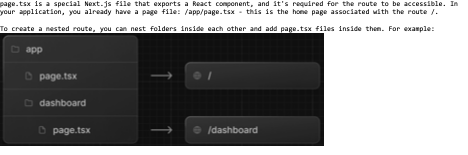

## Next.js App Router Course - Starter

This is the starter template for the Next.js App Router Course. It contains the starting code for the dashboard application.

For more information, see the [course curriculum](https://nextjs.org/learn) on the Next.js Website.

# Components

/app: Contains all the routes, components, and logic for your application, this is where you'll be mostly working from.
/app/lib: Contains functions used in your application, such as reusable utility functions and data fetching functions.
/app/ui: Contains all the UI components for your application, such as cards, tables, and forms. To save time, we've pre-styled these components for you.
/public: Contains all the static assets for your application, such as images.
Config Files: You'll also notice config files such as next.config.ts at the root of your application. Most of these files are created and pre-configured when you start a new project using create-next-app. You will not need to modify them in this course.
you can:
Use placeholder data in JSON format or as JavaScript objects.
Use a 3rd party service like mockAPI.
use Database

# Static

Next.js can serve static assets, like images, under the top-level /public folder. Files inside /public can be referenced in your application.
With regular HTML, you would add an image as follows:

However, this means you have to manually:

- Ensure your image is responsive on different screen sizes.
- Specify image sizes for different devices.
- Prevent layout shift as the images load.
- Lazy load images that are outside the user's viewport.

# Routes

Next.js uses file-system routing where folders are used to create nested routes. Each folder represents a route segment that maps to a URL segment.

Diagram showing how folders map to URL segments

You can create separate UIs for each route using layout.tsx and page.tsx files.

page.tsx is a special Next.js file that exports a React component, and it's required for the route to be accessible. In your application, you already have a page file: /app/page.tsx - this is the home page associated with the route /.

To create a nested route, you can nest folders inside each other and add page.tsx files inside each one of them. For example:
 --> /app/dashboard/page.tsx is associated with the /dashboard path.
Diagram showing how adding a folder called dashboard creates a new route '/dashboard'
